<h1 style="margin-bottom: -30px;">
𝐇𝐞𝐲, 𝐈'𝐦 𝐘𝐨𝐮𝐧𝐮𝐬 𝐀𝐥𝐢 𝐀𝐤𝐚𝐬𝐡 <a target="_blank">
    
</a>

[](https://git.io/typing-svg)
</h1>

<br/>
<br/>
<a target="_blank">
  
</a>

- 🔭 𝐈'𝐦 𝐜𝐮𝐫𝐫𝐞𝐧𝐭𝐥𝐲 𝐰𝐨𝐫𝐤𝐢𝐧𝐠 𝐨𝐧 **𝐅𝐫𝐨𝐧𝐭-𝐄𝐧𝐝 𝐃𝐞𝐯𝐞𝐥𝐨𝐩𝐦𝐞𝐧𝐭**
- 🌱 𝐈'𝐦 𝐂𝐮𝐫𝐫𝐞𝐧𝐭𝐥𝐲 𝐥𝐞𝐚𝐫𝐧𝐢𝐧𝐠 **𝐁𝐚𝐜𝐤𝐞𝐧𝐝 𝐓𝐞𝐜𝐡𝐧𝐨𝐥𝐨𝐠𝐢𝐞𝐬**
- 👯 𝐈'𝐦 𝐥𝐨𝐨𝐤𝐢𝐧𝐠 𝐭𝐨 𝐜𝐨𝐥𝐥𝐚𝐛𝐨𝐫𝐚𝐭𝐞 𝐨𝐧 **𝐖𝐞𝐛 𝐃𝐞𝐯𝐞𝐥𝐨𝐩𝐦𝐞𝐧𝐭 & 𝐂𝐥𝐨𝐮𝐝**
- 🤔 𝐈'𝐦 𝐥𝐨𝐨𝐤𝐢𝐧𝐠 𝐟𝐨𝐫 **𝐅𝐮𝐥𝐥 𝐓𝐢𝐦𝐞 𝐉𝐨𝐛**
- 💬 𝐀𝐬𝐤 𝐦𝐞 𝐚𝐧𝐲𝐭𝐡𝐢𝐧𝐠 [𝐡𝐞𝐫𝐞](https://github.com/younusaliakash/younusaliakash/issues/1) ! 𝐈'𝐦 𝐡𝐚𝐩𝐩𝐲 𝐭𝐨 𝐡𝐞𝐥𝐩.
- 😄 𝐏𝐫𝐨𝐧𝐨𝐮𝐧𝐬 : **𝐇𝐞/𝐇𝐢𝐦**
- ⚡ 𝐅𝐮𝐧 𝐅𝐚𝐜𝐭: **𝐈 𝐥𝐢𝐤𝐞 𝐭𝐨 𝐞𝐚𝐭 𝐁𝐢𝐫𝐞𝐲𝐚𝐧𝐢**
-  𝐇𝐨𝐦𝐞 : **𝐑𝐚𝐣𝐬𝐡𝐚𝐡𝐢, 𝐁𝐚𝐧𝐠𝐥𝐚𝐝𝐞𝐬𝐡** 

<br/>
<br/>

<p align="center">
   •
   •  
 

</p>

<!-- <p align="center">
  <a>
    
  </a>
</p> -->

#

**𝐋𝐚𝐧𝐠𝐮𝐚𝐠𝐞𝐬 & 𝐓𝐨𝐨𝐥𝐬:**

     

                

   

  

       

   


<table align="center">
  <tr>
    <td align="center" width="50%">
      </img>
    </td>
    <td align="center" width="50%">
      </img>
      <tr>
    </td>
  </tr>
  <tr>
    <td align="center" width="50%">
      </img>
    </td>
    <td align="center" width="50%">
       
    </td>
  </tr>
  <tr>
    <td  align="center" width="50%">
      </img>
      </img>
    </td>
    <td  align="center" width="50%">
       </img>
       
    </td
  </tr>
  <!-- <tr>
    <td align="center">
        </img> 
    </td>
    <td align="center">
        </img>
    </td>
  </tr> -->
  <tr>
    <td align="center">
        
    </td>
    <td align="center">
        
    </td>
  </tr>
  <tr>
    <td align="center" width="50%">
      
    </td>
    <td align="center" width="50%">
      
      <tr>
    </td>
  </tr>
  <tr>
    <td align="center" width="50%">
      
    </td>
    <td align="center" width="50%">
      
      <tr>
    </td>
  </tr>
  <tr>
    <td align="center" width="50%">
      
    </td>
    <td align="center" width="50%">
      
      <tr>
    </td>
  </tr>
  <!-- <tr>
    <td align="center" colspan="2">
      
    </td>
  </tr> -->
  <tr>
    <td align="center" colspan="2">
      <!--START_SECTION:waka-->

```all_time
From: 30 August 2023 - To: 06 September 2023

Total Time: 4 hrs 5 mins

Vue.js       2 hrs 52 mins   >>>>>>>>>>>>>>>>>>-------   70.36 %
JavaScript   52 mins         >>>>>--------------------   21.24 %
CSS          8 mins          >------------------------   03.28 %
TOML         4 mins          -------------------------   01.87 %
Ezhil        3 mins          -------------------------   01.39 %
Markdown     2 mins          -------------------------   00.88 %
HTML         1 min           -------------------------   00.58 %
JSON         0 secs          -------------------------   00.19 %
Other        0 secs          -------------------------   00.19 %
```

<!--END_SECTION:waka-->

 </td>
  </tr>
  <tr>
    <td align="center" colspan="2">
      
    </td>
  </tr>
  <tr>
    <td align="center" colspan="2">
      </img>
    </td>
  </tr>
  <tr>
    <td align="center" colspan="2">
       </img>
    </td>
  </tr>
  <!-- <tr>
    <td align="center" colspan="2">
      </img>
      <details><summary>Full history</summary></img></details>
    </td>
  </tr> -->
</table>


<h4>
  𝐂𝐨𝐧𝐧𝐞𝐜𝐭 𝐖𝐢𝐭𝐡 𝐌𝐞
  <a target="_blank">
    
  </a>
</h4>

<p align="center">
  <br>
  <a href="https://www.linkedin.com/in/younus-ali-akash/" target="_blank">
    <code></code>
  </a>
  <a href="https://www.facebook.com/md.younus.ali.akash/" target="_blank">
    <code></code>
  </a>
  <a href="https://twitter.com/younusali_akash" target="_blank">
    <code></code>
  </a>
  <a href="https://play.google.com/store/apps/developer?id=Younus+Ali+Akash+Software+Technology+Park+%28ASTP%29" target="_blank">
    <code></code>
  </a>
</p>


