<h1>

𝐇𝐞𝐲, 𝐈'𝐦 𝐘𝐨𝐮𝐧𝐮𝐬 𝐀𝐥𝐢 𝐀𝐤𝐚𝐬𝐡
<!--  -->
</h1>
<h3 align="center">

[;React%2CNode%2CExpress%2CGraphQL%2CSocket;MongoDB+%26+Other+Modern+Technologies;I'm+here+to+help+you)](https://git.io/typing-svg)

</h3>

 
 

- 🔭 𝙸’𝚖 𝚌𝚞𝚛𝚛𝚎𝚗𝚝𝚕𝚢 𝚠𝚘𝚛𝚔𝚒𝚗𝚐 𝚘𝚗 **Front-End Development**
- 🌱 𝙸’𝚖 𝚌𝚞𝚛𝚛𝚎𝚗𝚝𝚕𝚢 𝚕𝚎𝚊𝚛𝚗𝚒𝚗𝚐 **Backend Technogolies**
- 👯 𝙸’𝚖 𝚕𝚘𝚘𝚔𝚒𝚗𝚐 𝚝𝚘 𝚌𝚘𝚕𝚕𝚊𝚋𝚘𝚛𝚊𝚝𝚎 𝚘𝚗 **𝙰𝚗𝚍𝚛𝚘𝚒𝚍 and 𝚆𝚎𝚋 𝙳𝚎𝚟𝚎𝚕𝚘𝚙𝚖𝚎𝚗𝚝**
- 🤔 𝙸’𝚖 𝚕𝚘𝚘𝚔𝚒𝚗𝚐 𝚏𝚘𝚛 **Full Time Job**
- 💬 𝙰𝚜𝚔 𝙼𝚎 𝙰𝚋𝚘𝚞𝚝 𝙰𝚗𝚢𝚝𝚑𝚒𝚗𝚐 [here](https://github.com/younusaliakash/younusaliakash/issues/1) ! 𝙸 𝚊𝚖 𝚑𝚊𝚙𝚙𝚢 𝚝𝚘 𝚑𝚎𝚕𝚙.
- 😄 𝙿𝚛𝚘𝚗𝚘𝚞𝚗𝚜 : **𝙷𝚎/𝙷𝚒𝚖/𝙷𝚒𝚜**
- ⚡ 𝙵𝚞𝚗 𝚏𝚊𝚌𝚝 : **I like to eat Bireyani**
-  Home : **Rajshahi, Bangladesh** 

 
 

   •
   •  
 

#

  

#

**Languages & Tools:**

   

                

   

  

      

   

<!-- 

  <g-emoji class="g-emoji" alias="chart_with_upwards_trend" fallback-src="https://github.githubassets.com/images/icons/emoji/unicode/1f4c8.png">📈</g-emoji>
  <strong>𝙶𝚒𝚝𝚑𝚞𝚋 𝚂𝚝𝚊𝚝𝚜 : </strong>

  -->

<!-- <table align="center" overflow="hidden">
  <tr>
    <td align="center" width="50%">
      
    </td>
    <td align="center" width="50%">
      
      <tr>
    </td>
  </tr>
</table> -->

<!-- <strong>Public Contributions Graph : </strong> -->

<!--   -->

<!--  -->
<!--   -->

<!-- <strong>Daily Coding Status ( Included Private & Public Repo ) : </strong> -->
<!--   -->

<!--  -->

<!--   -->

<!-- 

  <g-emoji class="g-emoji" alias="chart_with_upwards_trend" fallback-src="https://github.githubassets.com/images/icons/emoji/unicode/1f4c8.png">📈</g-emoji>
  <strong>𝚆𝚊𝚔𝚊𝚃𝚒𝚖𝚎 𝚂𝚝𝚊𝚝𝚜 : </strong>

  -->

<!-- <table align="center" overflow="hidden">
  <tr>
    <td align="center" width="50%">
      
    </td>
    <td align="center" width="50%">
      
      <tr>
    </td>
  </tr>
  <tr>
    <td align="center" width="50%">
      
    </td>
    <td align="center" width="50%">
      
      <tr>
    </td>
  </tr>
  <tr>
    <td align="center" width="50%">
      
    </td>
    <td align="center" width="50%">
      
      <tr>
    </td>
  </tr>
</table>

<b>N.B : </b> All Statistic Generating From 30 Oct 2021
 -->

#

<!-- 

  
  <h4 align="center"><code>📊 𝙶𝚒𝚝𝙷𝚞𝚋 𝙼𝚎𝚝𝚛𝚒𝚌𝚜</code></h4>

 -->

<table align="center">
  <tr>
    <td align="center" width="50%">
      </img>
    </td>
    <td align="center" width="50%">
      </img>
      <tr>
    </td>
  </tr>
  <tr>
    <td align="center" width="50%">
      </img>
    </td>
    <td align="center" width="50%">
       
    </td>
  </tr>
  <tr>
    <td  align="center" width="50%">
      </img>
      </img>
    </td>
    <td  align="center" width="50%">
       </img>
       
    </td
  </tr>
  <tr>
    <td align="center">
        </img> 
    </td>
    <td align="center">
        </img>
    </td>
  </tr>
  <tr>
    <td align="center" width="50%">
      
    </td>
    <td align="center" width="50%">
      
      <tr>
    </td>
  </tr>
  <tr>
    <td align="center" width="50%">
      
    </td>
    <td align="center" width="50%">
      
      <tr>
    </td>
  </tr>
  <tr>
    <td align="center" width="50%">
      
    </td>
    <td align="center" width="50%">
      
      <tr>
    </td>
  </tr>
  <tr>
    <td align="center" colspan="2">
      </img>
    </td>
  </tr>
  <tr>
    <td align="center" colspan="2">
      
    </td>
  </tr>
  <tr>
    <td align="center" colspan="2">
      </img>
    </td>
  </tr>
  <tr>
    <td align="center" colspan="2">
       </img>
    </td>
  </tr>
  <tr>
    <td align="center" colspan="2">
      </img>
      

Full history
</img>

    </td>
  </tr>
</table>

<!-- ![Metrics](https://metrics.lecoq.io/younusaliakash?template=classic&isocalendar=1&languages=1&introduction=1&stars=1&gists=1&people=1&followup=1&lines=1&projects=1&activity=1&achievements=1&notable=1&isocalendar.duration=half-year&languages.limit=8&languages.sections=most-used&languages.colors=github&languages.threshold=0%25&languages.indepth=false&languages.analysis.timeout=15&languages.categories=markup%2C%20programming&languages.recent.categories=markup%2C%20programming&languages.recent.load=300&languages.recent.days=14&introduction.title=true&stars.limit=4&people.limit=24&people.size=28&people.types=followers%2C%20following&people.identicons=false&people.shuffle=false&followup.sections=repositories&projects.limit=4&projects.descriptions=false&activity.limit=5&activity.load=300&activity.days=14&activity.filter=all&activity.visibility=all&activity.timestamps=false&achievements.threshold=C&achievements.secrets=true&achievements.display=detailed&achievements.limit=0&notable.from=organization&notable.repositories=false&config.timezone=Asia%2FDhaka) -->

<h4>
  Connect With Me
  
</h4>

   
  <a href="https://www.linkedin.com/in/younus-ali-akash/" target="_blank">
    <code></code>
  </a>
  <a href="https://www.facebook.com/md.younus.ali.akash/" target="_blank">
    <code></code>
  </a>
  <a href="https://twitter.com/younusali_akash" target="_blank">
    <code></code>
  </a>
  <a href="https://play.google.com/store/apps/developer?id=Younus+Ali+Akash+Software+Technology+Park+%28ASTP%29" target="_blank">
    <code></code>
  </a>

